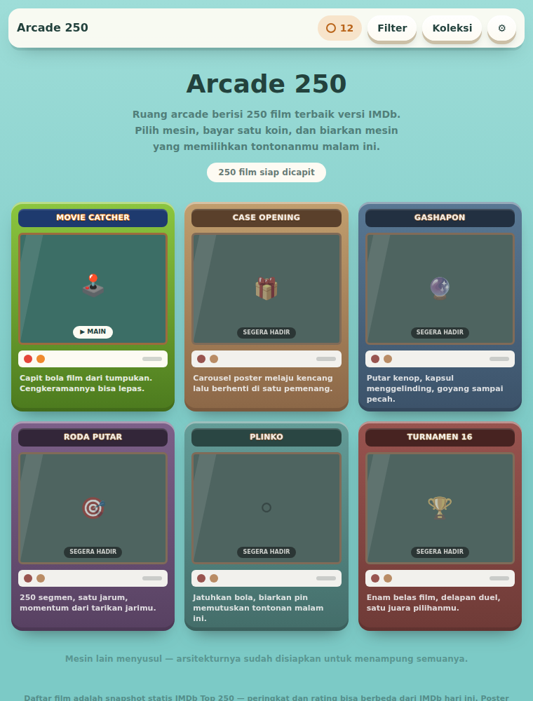

# ARCADE 250

Randomizer 250 film terbaik versi IMDb, berbentuk **ruang arcade**. Mesin utamanya
adalah mesin capit sungguhan: kapsul-kapsul film ditumpuk dengan physics, derek
menjepit dengan kekuatan yang diundi, dan cengkeramannya **bisa lepas di tengah
jalan**. Film yang kamu dapat adalah kapsul yang benar-benar berhasil kamu capit.




## Jalankan

```bash
npm install
npm run dev        # http://localhost:5173
npm run build      # keluaran statis di dist/
npm run preview    # uji hasil build di http://localhost:4173
```

Hasil build sepenuhnya statis — bisa langsung ditaruh di GitHub Pages, Netlify,
atau hosting statis mana pun. `base` di `vite.config.ts` sudah relatif, jadi
situs tetap jalan dari sub-path.

## Tampilan

Gaya visualnya ilustrasi datar ala mesin arcade sungguhan: kabinet hijau apel,
marquee navy bergaris luar oranye, bingkai kayu, dek kontrol krem dengan
joystick dan tombol arcade, serta bola-bola mainan putih bergaris warna di
dalam kabin. Kabinet berdiri di atas lantai kayu berkarpet, diapit tirai.
Tipografi memakai Fredoka untuk papan nama dan Nunito untuk teks.

Warna pita tiap bola menandakan tier peringkatnya: oranye untuk sepuluh besar,
ungu untuk 11-50, biru untuk 51-120, hijau untuk sisanya.

## Cara mesinnya bekerja

Derek digerakkan dengan `◀ ▶` lalu diturunkan dengan `TURUN` (keyboard: panah
kiri/kanan dan spasi). Yang terjadi setelah itu:

1. **Turun** — derek berhenti tepat di atas tumpukan di bawahnya, bukan selalu ke dasar.
2. **Menjepit** — kapsul terdekat dipilih, lalu peluang menggenggam dihitung dari
   **seberapa tepat bidikanmu**: `0,34 + akurasi × 0,42`. Membidik tepat di tengah
   kapsul benar-benar menaikkan peluang.
3. **Mengangkat & menggeser** — kalau undian cengkeraman gagal, waktu lepasnya
   sudah dijadwalkan di titik acak sepanjang perjalanan. Kapsulnya akan jatuh,
   dan kamu akan melihatnya jatuh.
4. **Meluncur ke lubang** — kapsul yang selamat jatuh ke lubang hadiah dan pecah
   jadi kartu film.

Ekonomi koin: satu kali turun = satu koin, **menang mengembalikan koin itu**.
Jadi yang mahal adalah gagal capit, bukan bermainnya.

Yang penting: kapsul di kabin adalah sampel acak dari pool yang **sudah difilter**,
dan kapsul yang tercapit itulah hadiahnya. Filter benar-benar dihormati tanpa
perlu mencurangi hasil physics.

## Filter

Genre, dekade, rating IMDb minimal, durasi maksimal (`< 100 menit` untuk malam
yang sudah larut), dan opsi menyembunyikan film yang sudah kamu tandai ditonton.
Mengubah filter akan mengisi ulang kabin.

## Data dan poster

**Daftar filmnya adalah snapshot statis**, bukan feed live. IMDb tidak
menyediakan API publik gratis dan peringkatnya bergeser setiap hari, jadi 250
entri di `src/data/movies.ts` sengaja dibekukan: peringkat dan rating di sana
adalah perkiraan dan bisa berbeda dari IMDb hari ini.

**Poster diambil saat runtime di browser pengunjung**, dengan dua tingkat:

| Urutan | Sumber | Perlu API key? |
|--------|--------|----------------|
| 1 | TMDB (`search/movie` lalu `image.tmdb.org`) | ya, opsional — tempel di Pengaturan |
| 2 | Wikipedia `pageimages` (CORS terbuka) | **tidak** |
| 3 | Kartu bergaya yang digambar sendiri | — |

Tanpa setup apa pun situs tetap menampilkan poster asli lewat Wikipedia. API key
TMDB disimpan hanya di `localStorage` browser dan tidak pernah dikirim ke mana
pun selain TMDB. Hasil resolve di-cache (hit 30 hari, miss 1 hari) supaya
kunjungan berikutnya tidak memanggil jaringan sama sekali.

Kalau jaringan diblokir sepenuhnya, semua kapsul jatuh ke kartu bergaya dan
mesinnya tetap berfungsi penuh.

## Arsitektur

```
src/
  data/movies.ts              250 entri sebagai tuple ringkas + parser bertipe
  lib/
    posters.ts                resolver bertingkat + cache + antrean paralel
    sound.ts                  seluruh SFX disintesis WebAudio (nol file audio)
    shareCard.ts              render kartu hasil 900x1400 ke PNG
    useArcade.ts              koin, riwayat, watchlist, tanda ditonton, filter
  components/
    Lobby.tsx                 ruang arcade; registry mesin
    ClawMachine/
      game.ts                 physics matter.js + renderer canvas
      index.tsx               kontrol, keyboard, HUD
    PrizeReveal.tsx           kartu hadiah + aksi
```

Efek suara **tidak memakai satu pun file audio** — semuanya dibangkitkan dengan
oscillator dan derau WebAudio, jadi nol byte aset dan nadanya pas dengan tema
8-bit. `AudioContext` baru dibuat setelah ada interaksi pengguna.

## Verifikasi

Dua suite Playwright menjalankan situs di browser sungguhan:

```bash
npm run build
npm run preview &
npm run smoke          # lobby, render canvas, siklus capit, filter, mobile
npm run smoke:coins    # invarian: koin == awal - jumlah_drop + jumlah_menang
```

`smoke:coins` yang menjaga hal terpenting: mesin tidak boleh memberi hadiah yang
tidak dicapit. Kalau perlu, tunjuk Chromium lewat `CHROMIUM_PATH`, dan alamat
lain lewat `BASE_URL`.

## Aksesibilitas

Seluruh permainan bisa dijalankan dari keyboard. Perubahan fase derek diumumkan
lewat `role="status"` + `aria-live`. `prefers-reduced-motion` mematikan lampu
berkedip, guncangan layar, dan kilatan kemenangan — physics dan permainannya
tetap utuh.
Situs tidak punya scroll horizontal di lebar ponsel.

## Mesin berikutnya

Lobby sudah berupa registry, jadi mesin baru tinggal ditambahkan sebagai entri
dan satu komponen. Yang sudah disiapkan tempatnya: Case Opening, Gashapon, Roda
Putar, Plinko, dan Turnamen 16 Besar.
