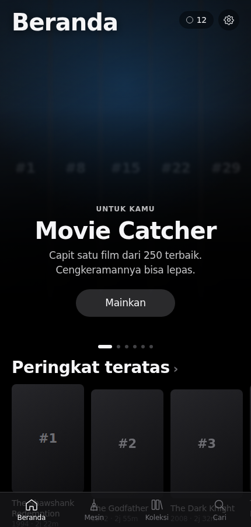
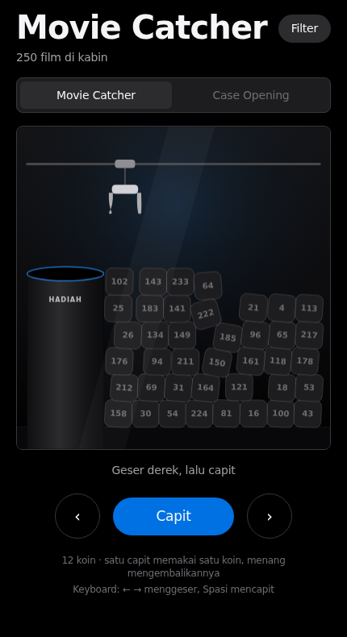
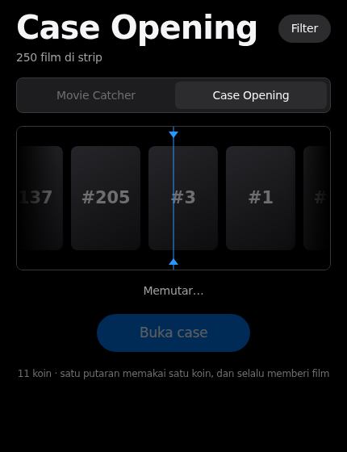
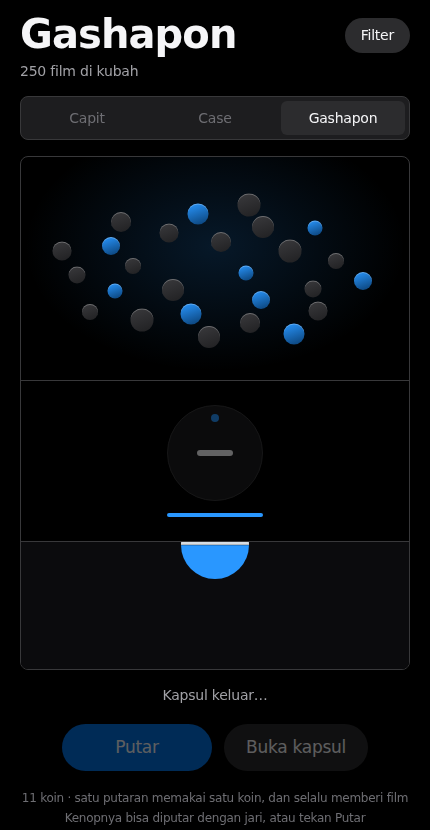
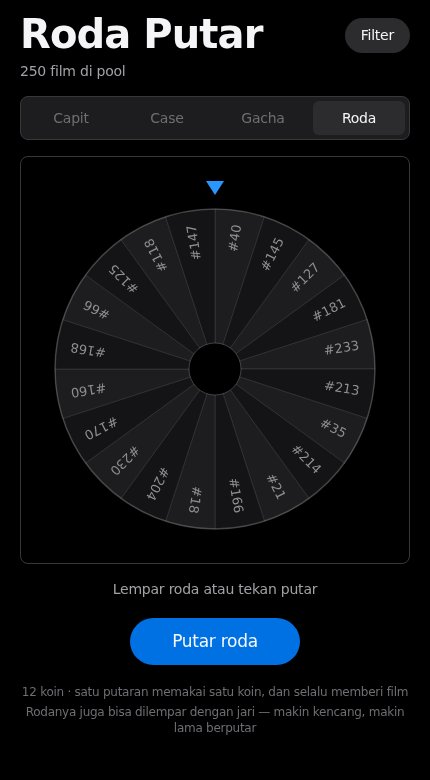
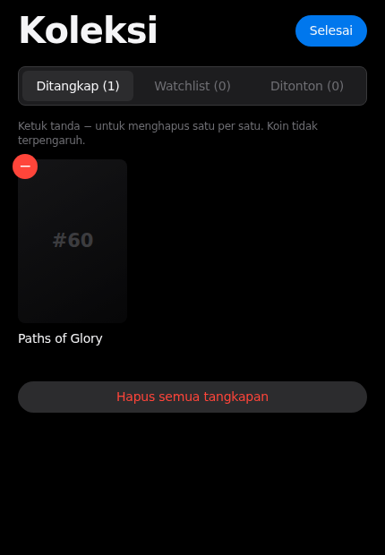

# Arcade 250

Randomizer 250 film terbaik versi IMDb, dikemas sebagai aplikasi bergaya
**Apple Arcade**. Ada empat mesin, dan semuanya memegang janji yang sama: apa
yang kamu lihat berhenti di layar itulah film yang kamu dapat.











## Jalankan

```bash
npm install
npm run dev        # http://localhost:5173
npm run build      # keluaran statis di dist/
npm run preview    # uji hasil build di http://localhost:4173
```

Hasil build sepenuhnya statis — bisa langsung ditaruh di GitHub Pages, Netlify,
atau hosting statis mana pun.

## Tampilan

Mengikuti [`docs/DESIGN.md`](docs/DESIGN.md) (sistem desain Apple), diadaptasi ke permukaan gelap
seperti aplikasi Apple Arcade. Yang dipegang dari dokumen itu:

- **Satu biru untuk aksi terisi** (`#0071e3`); `#2997ff` hanya dekoratif.
- **Tanpa drop shadow.** Hierarki dibangun dari pergeseran permukaan
  (`#000` → `#1d1d1f` → `#2c2c2e`) dan garis rambut `#38383a`.
- **Radius 980px** untuk setiap pil, **8px** untuk kartu dan gambar.
- **Negative tracking** yang mengetat seiring ukuran huruf, memakai SF Pro pada
  perangkat Apple dan Inter sebagai pengganti di tempat lain.

Tiga penyimpangan yang disengaja, karena mengikuti tangkapan layar Apple Arcade
alih-alih halaman apple.com: permukaannya gelap; ada satu pil kaca buram untuk
aksi di atas artwork hero; dan ubin persegi kecil memakai radius 18px supaya
terbaca sebagai ikon aplikasi, bukan sebagai gambar.

Strukturnya juga mengikuti Arcade: hero carousel yang maju sendiri, rak konten
bergulir horizontal, dan tab bar tetap di bawah — Beranda, Mesin, Koleksi, Cari.

## Mesin

### Movie Catcher — mesin capit

Derek digeser dengan `‹ ›` lalu diturunkan dengan **Capit** (keyboard: panah
kiri/kanan dan spasi). Yang terjadi setelah itu:

1. **Turun** — derek berhenti tepat di atas tumpukan di bawahnya, bukan selalu ke dasar.
2. **Menjepit** — ubin terdekat dipilih, lalu peluang menggenggam dihitung dari
   **seberapa tepat bidikanmu**: `0,34 + akurasi × 0,42`. Membidik tepat di tengah
   ubin benar-benar menaikkan peluang.
3. **Mengangkat & menggeser** — kalau undian cengkeraman gagal, waktu lepasnya
   sudah dijadwalkan di titik acak sepanjang perjalanan. Ubinnya akan jatuh,
   dan kamu akan melihatnya jatuh.
4. **Meluncur ke lubang** — ubin yang selamat jatuh ke lubang hadiah dan membuka
   lembar detail film.

Ubin di kabin adalah sampel acak dari pool yang **sudah difilter**, dan ubin
yang tercapit itulah hadiahnya. Filter benar-benar dihormati tanpa perlu
mencurangi hasil physics.

### Case Opening

Strip poster melaju kencang lalu melambat dan berhenti tepat di penanda tengah,
dengan detik yang berbunyi tiap poster melintas.

Pemenangnya **ditentukan lebih dulu**, lalu posisi berhentinya dihitung mundur
dari situ — jadi ubin di bawah penanda dijamin sama dengan hadiah yang
diberikan, bukan hasil tebakan visual. Titik berhentinya diberi sedikit
kemelesetan acak supaya tidak terasa mekanis, tapi tetap jauh di dalam batas
ubin pemenang. `npm run smoke:case` menjaga janji itu.

### Gashapon

Dua tahap, dan keduanya perlu tanganmu: **putar kenop satu lingkaran penuh**,
lalu **pecahkan kapsulnya**. Kenopnya bisa diseret melingkar dengan jari —
memutar balik mengurangi progres, seperti kenop sungguhan — dan ada tombol
Putar untuk keyboard atau sekali ketuk.

Melepas kenop sebelum penuh tidak menghanguskan koin: putaran diselesaikan
otomatis, karena koinnya sudah terpakai saat kenop pertama kali disentuh.

### Roda Putar

Roda berisi sampai 20 film dari pool yang sudah difilter. Bisa dilempar dengan
jari — makin kencang lemparannya, makin banyak putaran dan makin lama melambat
— atau ditekan lewat tombol.

Sama seperti Case Opening, pemenangnya ditentukan lebih dulu dan sudut
berhentinya dihitung mundur dari situ. `npm run smoke:wheel` tidak mempercayai
komponennya: ia membaca sudut putaran mentah, menghitung sendiri segmen mana
yang berada di jam 12, lalu membandingkannya dengan hadiah yang diberikan.

### Ekonomi koin

Satu permainan memakai satu koin di keempat mesin, tapi pengembaliannya berbeda
karena peluangnya berbeda:

| Mesin | Bisa gagal? | Koin kembali saat menang? |
|-------|-------------|---------------------------|
| Movie Catcher | ya, cengkeraman bisa lepas | ya — yang mahal adalah meleset |
| Case Opening | tidak, selalu memberi film | tidak — kalau dikembalikan, mesin ini jadi gratis tanpa batas |
| Gashapon | tidak, selalu memberi film | tidak — alasan yang sama |
| Roda Putar | tidak, selalu memberi film | tidak — alasan yang sama |

## Sinkron antar perangkat

Secara bawaan koleksi disimpan di `localStorage`, yang artinya **per-browser
per-perangkat** — membuka situs yang sama di HP akan mulai dari kosong. Itu
perilaku `localStorage`, bukan kekurangan hosting: datanya memang tidak pernah
meninggalkan browser.

Supaya menyeberang, ada **kode sync**. Di Pengaturan, satu perangkat menekan
"Buat kode sync" dan mendapat kode delapan karakter seperti `NGSB-6M5C`;
perangkat lain memasukkan kode itu. Setelah tersambung, koin, tangkapan,
watchlist, dan tanda ditonton mengikuti ke mana pun kamu buka. Tidak ada akun
dan tidak ada login — kodenya sendiri yang jadi kuncinya, jadi perlakukan
seperti kata sandi.

Filter sengaja **tidak** ikut disinkron: itu preferensi per-perangkat.

### Memasangnya di Vercel

1. Buka project di Vercel → **Storage** → **Create Database** → **Upstash
   Redis** (ada paket gratis) → **Connect** ke project ini.
2. Vercel memasang `KV_REST_API_URL` dan `KV_REST_API_TOKEN` sendiri. Nama dari
   integrasi Upstash langsung (`UPSTASH_REDIS_REST_*`) juga diterima.
3. Deploy ulang.

Tanpa langkah ini aplikasi tetap berjalan normal — hanya bagian sinkronisasi
yang melaporkan bahwa penyimpanan bersama belum dipasang, dan semuanya kembali
tersimpan lokal saja.

### Cara kerjanya

`api/state.js` menyimpan satu dokumen per kode, dengan protokol kecil:

```
GET  /api/state?code=XXXXXXXX   -> { version, data }
PUT  /api/state { code, version, data }
     -> 200 { version }          bila version cocok
     -> 409 { version, data }    bila sudah didahului perangkat lain
```

`version` adalah penghitung naik. Perangkat yang tertinggal ditolak dan
menerima kembali isi terbaru, jadi perubahan tidak ditimpa diam-diam.
**Server yang jadi acuan**: tiap perangkat menarik ulang saat dibuka dan saat
tab kembali dilihat, dan mengirim perubahannya setelah jeda singkat. Karena itu
penghapusan ikut menyeberang dengan benar. Kalau dua perangkat mengubah pada
saat yang sama, yang terakhir menang.

Dokumen kedaluwarsa otomatis setelah 180 hari tanpa aktivitas.

## Mengelola tangkapan



Coba-coba mencapit tidak perlu ditebus dengan mereset semua progres. Di tab
**Koleksi**, tombol **Edit** memunculkan tanda − di tiap ubin untuk menghapus
satu per satu, plus aksi mengosongkan seluruh daftar. Cara yang sama berlaku
untuk watchlist dan tanda sudah ditonton.

Lembar hadiah juga punya **Batalkan tangkapan** tepat setelah menang, dan
lembar detail film punya **Hapus dari tangkapan** untuk film yang sudah
tercatat. Menghapus catatan **tidak mengubah koin** — koinnya sudah selesai
dihitung saat permainan berakhir.

## Poster

**Poster diambil saat runtime di browser pengunjung**, dengan dua tingkat:

| Urutan | Sumber | Perlu API key? |
|--------|--------|----------------|
| 1 | TMDB (`search/movie` lalu `image.tmdb.org`) | ya, opsional — tempel di Pengaturan |
| 2 | Wikipedia `pageimages` | **tidak** |
| 3 | Kartu peringkat yang digambar sendiri | — |

Tanpa setup apa pun situs menampilkan poster asli lewat Wikipedia. API key TMDB
disimpan hanya di `localStorage` dan tidak pernah dikirim ke mana pun selain TMDB.

### Kalau poster tidak muncul

Tiga hal yang menentukan, dan ketiganya sudah ditangani di `src/lib/posters.ts`:

1. **`pilicense=any`.** Parameter ini default-nya `free`. Poster film di
   Wikipedia hampir seluruhnya non-free (fair use), jadi tanpa `any` API memang
   sengaja tidak mengembalikan posternya sama sekali. Ini penyebab paling umum
   "banyak poster tidak muncul".
2. **Hasil teratas belum tentu punya gambar.** Pencarian mengambil lima kandidat
   dan memakai yang pertama punya thumbnail, mengikuti urutan relevansi; kalau
   semuanya kosong, pencarian diulang tanpa tahun.
3. **Jangan membanjiri API.** Poster baru diminta saat mendekati viewport, dan
   semuanya lewat satu antrean dengan batas empat permintaan paralel. Tanpa ini,
   satu layar penuh poster menembakkan ratusan permintaan sekaligus dan sebagian
   ditolak karena pembatasan laju.

Kalau masih ada yang kosong: buka **Pengaturan**, lihat hitungan
"tersimpan / gagal", lalu tekan **Coba ulang yang gagal**. Kegagalan hanya
di-cache 30 menit, jadi memuat ulang halaman nanti juga akan mencobanya lagi.

## Data

**Daftar filmnya adalah snapshot statis**, bukan feed live. IMDb tidak
menyediakan API publik gratis dan peringkatnya bergeser setiap hari, jadi 250
entri di `src/data/movies.ts` sengaja dibekukan: peringkat dan rating di sana
adalah perkiraan dan bisa berbeda dari IMDb hari ini.

## Arsitektur

```
src/
  data/movies.ts              250 entri sebagai tuple ringkas + parser bertipe
  lib/
    posters.ts                resolver bertingkat, cache, antrean paralel
    sync.ts                   kode sync, tarik/kirim, penanganan konflik
    shelves.ts                definisi rak konten di beranda
    sound.ts                  seluruh SFX disintesis WebAudio (nol file audio)
    shareCard.ts              render kartu hasil 900x1400 ke PNG
    useArcade.ts              koin, riwayat, watchlist, tanda ditonton, filter
  components/
    HeroCarousel.tsx          carousel mesin unggulan
    HomeScreen / SearchScreen / LibraryScreen
    TabBar.tsx                navigasi bawah
    MachineScreen.tsx         kepala layar mesin + pemilih mesin
    MovieSheet.tsx            lembar detail; dipakai ulang sebagai layar hadiah
    ClawMachine/
      game.ts                 physics matter.js + renderer canvas
      index.tsx               kontrol, keyboard, status
    CaseOpening/
      index.tsx               strip poster, animasi berhenti, penanda
    Gashapon/
      index.tsx               kenop putar, kapsul, laci
    Wheel/
      index.tsx               roda canvas, lemparan jari, jarum
api/
  state.js                    penyimpanan state bersama (Upstash/Vercel KV)
```

Efek suara **tidak memakai satu pun file audio** — semuanya dibangkitkan dengan
oscillator dan derau WebAudio. `AudioContext` baru dibuat setelah ada interaksi
pengguna.

## Verifikasi

Tiga suite Playwright menjalankan situs di browser sungguhan:

```bash
npm run build
npm run preview &
npm run smoke          # beranda, hero, mesin, filter, hapus tangkapan, cari, mobile
npm run smoke:coins    # invarian: koin == awal - jumlah_capit + jumlah_menang
npm run smoke:case     # hadiah Case Opening == ubin di bawah penanda
npm run smoke:gacha    # dua tahap Gashapon, termasuk jalur yang mudah tersangkut
npm run smoke:wheel    # hadiah Roda Putar == segmen di bawah jarum
npm run smoke:posters  # resolver poster, dengan respons Wikipedia dipalsukan
npm run smoke:sync     # dua perangkat berbagi koleksi lewat satu kode
```

`smoke:sync` menjalankan dua konteks browser terpisah — dua `localStorage`
berbeda, persis seperti laptop dan HP — lalu memastikan koleksi menyeberang
setelah kode disambungkan, **penghapusan ikut menyeberang** (bukan cuma
penambahan), dan perangkat tanpa kode tetap terpisah. Servernya
(`scripts/dev-sync-server.mjs`) mengimpor handler dari `api/state.js` dan hanya
mengganti penyimpanannya dengan Map di memori, jadi yang diuji adalah kode yang
benar-benar berjalan di produksi.

Tiap mesin punya penjaga kejujurannya sendiri. `smoke:coins` memastikan mesin
capit tidak pernah memberi hadiah yang tidak dicapit. `smoke:case` membaca
geometri strip setelah animasi berhenti dan membandingkan ubin di bawah penanda
dengan hadiah yang diberikan — kalau keduanya berbeda, animasinya berbohong.
`smoke:gacha` menelusuri ketiga jalur masukan kenop, termasuk dua yang mudah
membuat mesin tersangkut: melepas kenop sebelum satu putaran penuh, dan menekan
kenop tanpa memutarnya sama sekali.

`smoke` juga mengunci hero di lebar desktop: tombol Mainkan pernah hilang karena
tinggi slide bergantung rantai `aspect-ratio` → `max-height` → `h-full`, jadi
sekarang tingginya eksplisit dan kontennya berada di alur normal, bukan
diposisikan absolut.

`smoke:posters` membuktikan tiga hal yang mudah salah pada resolver:
`pilicense=any` terkirim, kandidat tanpa thumbnail dilewati lalu pencarian
diulang tanpa tahun, dan kandidat dipilih menurut peringkat relevansi bukan
urutan kunci objek.

Kalau perlu, tunjuk Chromium lewat `CHROMIUM_PATH` dan alamat lain lewat
`BASE_URL`.

## Aksesibilitas

Seluruh permainan bisa dijalankan dari keyboard. Perubahan fase derek diumumkan
lewat `role="status"` + `aria-live`. `prefers-reduced-motion` menghentikan
carousel yang maju sendiri, guncangan layar, dan kilatan kemenangan — physics
dan permainannya tetap utuh. Situs tidak punya scroll horizontal di lebar ponsel.

## Mesin berikutnya

Carousel beranda sudah berupa daftar mesin dan layar mesin sudah punya pemilih,
jadi mesin baru tinggal ditambahkan sebagai satu entri dan satu komponen. Yang
sudah disiapkan tempatnya: Plinko dan Turnamen 16 Besar.
